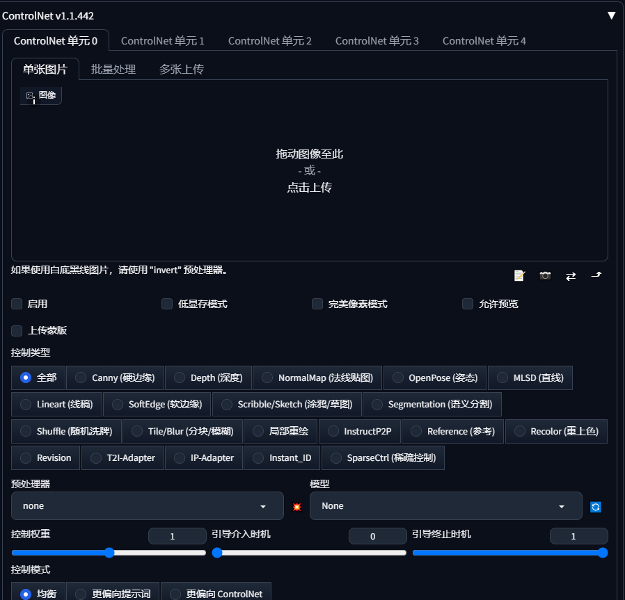
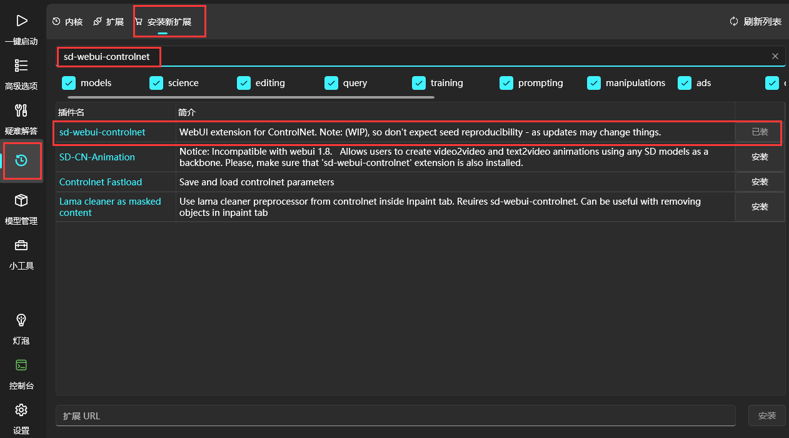

### controlNet使用教程

- [controlNet使用教程](#controlnet使用教程)
  - [模型下载安装](#模型下载安装)
  - [模型作用介绍](#模型作用介绍)
  - [模型使用](#模型使用)

#### 模型下载安装
- 链接：https://pan.quark.cn/s/c535a92cb0ab
提取码：AY2R

- 或huggingface官网下载 https://huggingface.co/lllyasviel/ControlNet-v1-1/tree/main
  
将下载好的模型放在 models/ControlNet 目录下

启动WebUI，在文生图或图生图页面下拉，找到controlNet模块

若WebUI没有该模块，在绘世启动器中打开版本管理-安装新扩展，输入sd-webui-controlnet搜索插件并安装，然后重启WebUI

#### 模型作用介绍

| 模型名        | 用途                                                |
| :---------------------------------- | :--------------------------------------- |
| OpenPose              | 姿态控制、表情控制                                         |
| Depth                 | 描绘富有空间感的多层次场景（景深控制）、人物肢体交叠（人体透视）                  |
| NormalMap             | 从原图中提取 3D 物体的法线向量，绘制的新图与原图的光影效果完全相同               |
| Lineart               | 提取动漫的线稿                                           |
| Canny                 | 用于识别输入图像的边缘信息。从上传的图片中生成线稿，然后根据关键词来生成与上传图片同样构图的画面。 |
| MLSD                  | 通过分析图片中的线条结构和几何形状，可以构建建筑物的外框，适合建筑、室内设计的朋友使用       |
| Scribble              | 根据草图（涂鸦）绘制图片                                      |
| Semantic Segmentation | 语义分割绘制                                            |

#### 模型使用

1. 在图生图或文生图时，勾选启用controlNet

2. 选择需要的控制类型，查看是否自动加载了对应的预处理器和模型，如果没有自动加载，则需下载对应预处理器和模型
3. 上传参考图片（如需要）
4. 可勾选完美像素模式以获取更佳参考效果
5. 勾选允许预览时，会生成对应的控制图片
6. 其余参数可保持默认

